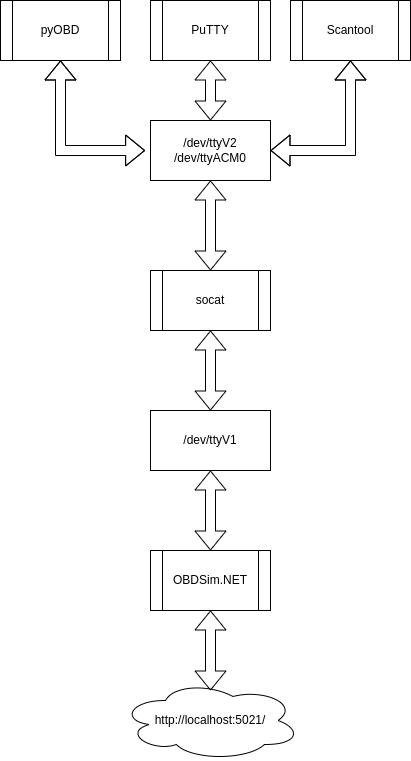
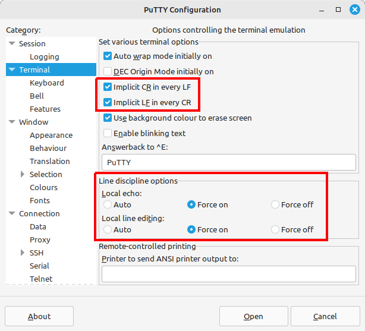

# OBDSim.NET
Simulating an OBD car connection from the comfort of your desk



## Requirements
* .NET 8 SDK
* git

### Linux
* socat
  ```bash
  sudo apt install -y socat
  ```
 
### Windows
* [com0com](https://com0com.sourceforge.net/)

### Optional
* [Scantool](https://samhobbs.co.uk/2015/04/scantool-obdii-car-diagnostic-software-linux)
  ```bash
  sudo apt install -y scantool
  ```
  * [Scantool source](https://github.com/kees/scantool/tree/trunk)
* [PuTTY](https://www.putty.org/)
  <details>

  

  </details>

* [DrawIO](https://github.com/jgraph/drawio-desktop/releases)
* [pyOBD](https://github.com/barracuda-fsh/pyobd)
  <details>

  `ImportError: cannot import name 'Self' from 'typing_extensions' (/usr/lib/python3/dist-packages/typing_extensions.py)`

  https://github.com/python-openxml/python-docx/issues/1337

  ```bash
  pip install typing-extensions --upgrade
  ```

  </details>

## Getting started

```bash
# clone repository
git clone https://github.com/TrevorDArcyEvans/OBDSim.NET.git

# build code
cd OBDSim.NET/src
dotnet build

# run main app
cd OBDSim.NET/bin/Debug/net8.0/
./OBDSim.NET
```

Open [home page](https://localhost:5021/)

## Setting up serial ports

### Linux

<details>

  ```bash
  sudo socat -d -d PTY,link=/dev/ttyV1,echo=0,unlink-close=0,user=trevorde PTY,link=/dev/ttyV2,echo=0,unlink-close=0,user=trevorde

  sudo socat -d -d PTY,link=/dev/ttyV1,echo=0,unlink-close=0,user=trevorde PTY,link=/dev/ttyACM0,echo=0,unlink-close=0,user=trevorde

  sudo chmod 777 /dev/ttyV1 && sudo chmod 777 /dev/ttyV2 && sudo chmod 777 /dev/ttyACM0

  # pyobd
  cd pyobd
  python3 pyobd.py
  ```

 </details>

### Windows

<details>

Use com0com (somehow)

 </details>

## Further information
  * [pythonOBD](https://python-obd.readthedocs.io/en/latest/)
  * [ELM327 AT Commands](https://cdn.sparkfun.com/assets/c/8/e/3/4/521fade6757b7fd2768b4574.pdf)
  * [OBD Now Terminal](https://glmsoftware.com/documentation/obdnowterminaluserguide.pdf)

## Acknowledgments
* OBD
  * [Get OBD2 Data via ELM327 C#.NET](https://burak.alakus.net/en/2011/07/27/to-get-obd2-data-via-elm327-c/)
  * [OBD2NET](https://github.com/0x8DEADF00D/obd2NET)
  * [OBD-II PIDs](https://en.wikipedia.org/wiki/OBD-II_PIDs)
